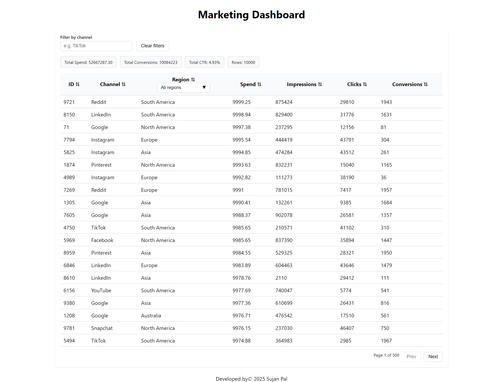

# 📊 React Data Table UI (Reusable Component System)

A lightweight & reusable UI system built with **React + Vite + TypeScript**, featuring a sortable, searchable, and paginated table.  
Includes reusable components: `Button`, `Input`, and `Dropdown`, styled using a **single color theme via CSS variables**.

---

## 🚀 Features

✔️ Reusable UI Components  
✔️ Search & Filter (by Channel and Region)  
✔️ Sorting (ASC / DESC toggle on header click)  
✔️ Pagination  
✔️ Summary metric section (Spend, CTR, Clicks, Conversions)  
✔️ Clean modern CSS with configurable theme via variables  
✔️ Mobile-responsive table layout

---

## 🧩 Components Included

| Component   | Description                                                |
| ----------- | ---------------------------------------------------------- |
| `Button`    | Supports primary + secondary variants & disabled states    |
| `Input`     | With label, error support & onChange binding               |
| `Dropdown`  | Fully controlled select menu with keyboard support         |
| `DataTable` | Main table UI with filtering, sorting, pagination & totals |

---

## 🎨 Theme / Styling

All colors are defined in one place using CSS variables (`:root`) so the theme can be changed using just a few values:

```css
:root {
  --primary: #2563eb;
  --primary-light: #eff6ff;
  --text: #111827;
  --border: #d1d5db;
  --bg: #ffffff;
}
```


